# ECE 366 Project 4
## Group Members
### Amaan Baiyat
### Arsalan Babar

## A1
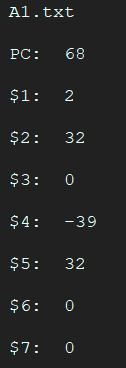

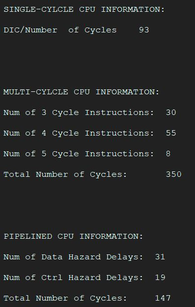
## CACHE HITS AND MISSES
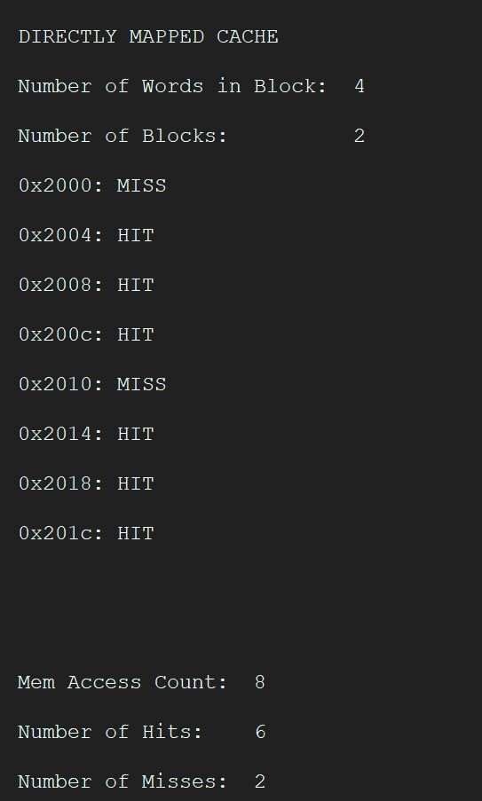

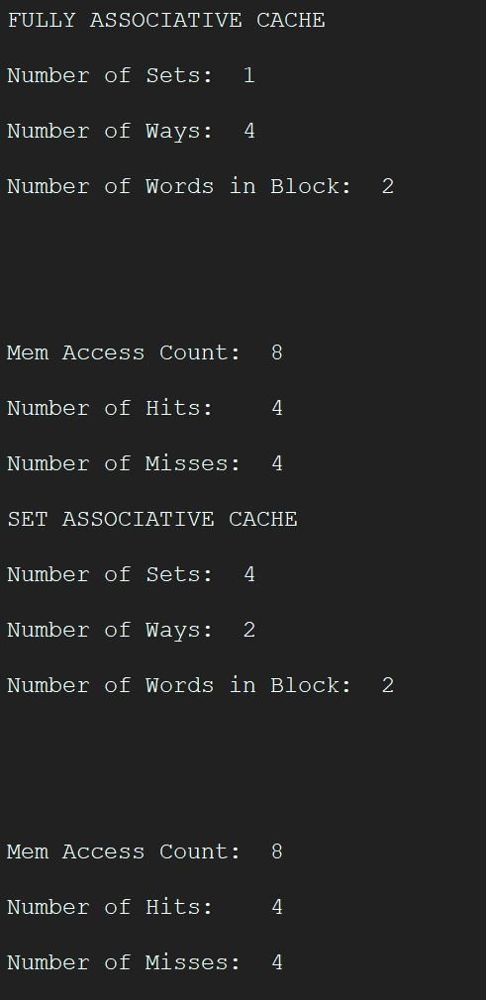

## A2

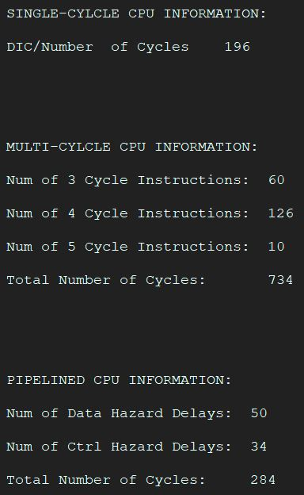

## CACHE HITS AND MISSES

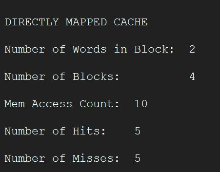

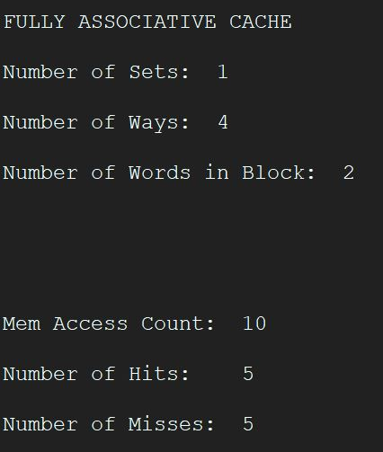

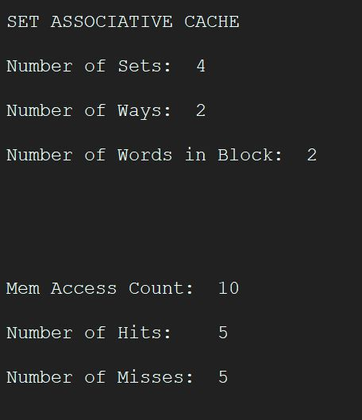
## B1
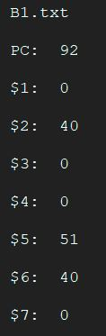

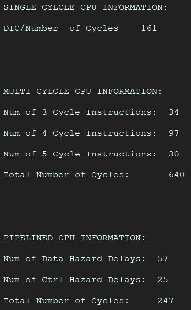

## CACHE HITS AND MISSES
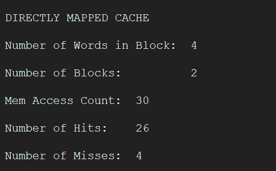

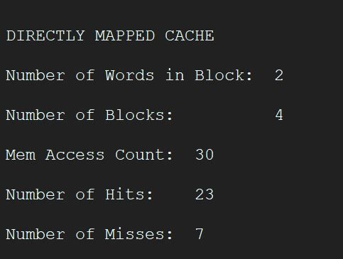

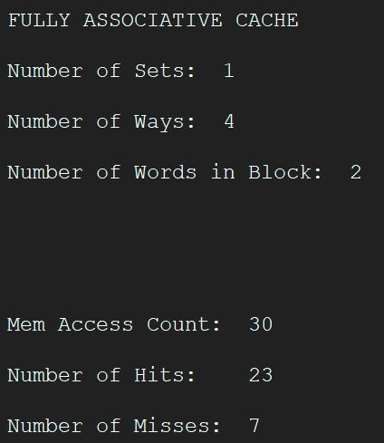

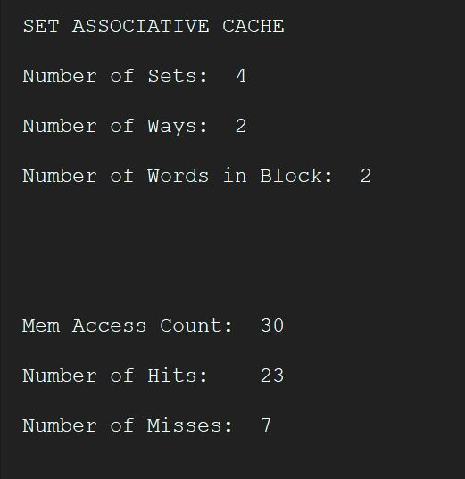

## B2

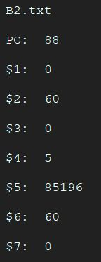

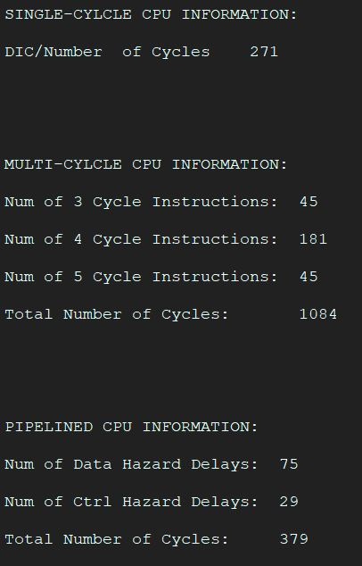

## CACHE HITS AND MISSES 
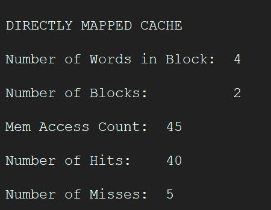

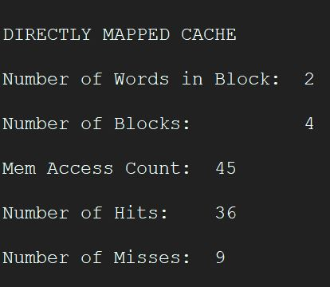

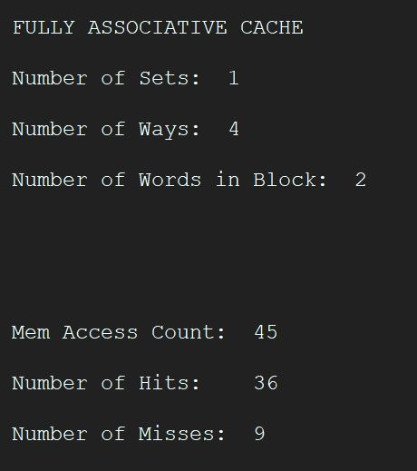

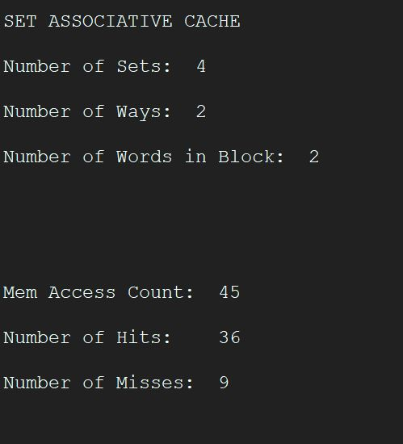

