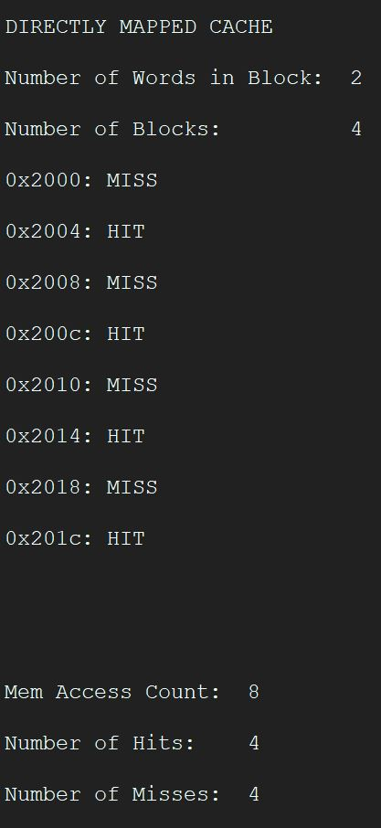
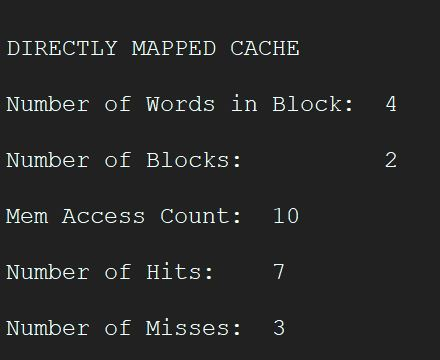

# ECE 366 Project 4
## Group Members
### Amaan Baiyat
### Arsalan Babar

## A1

## CACHE HITS AND MISSES

## A2

## CACHE HITS AND MISSES

## B1

## CACHE HITS AND MISSES

## B2

## CACHE HITS AND MISSES 

